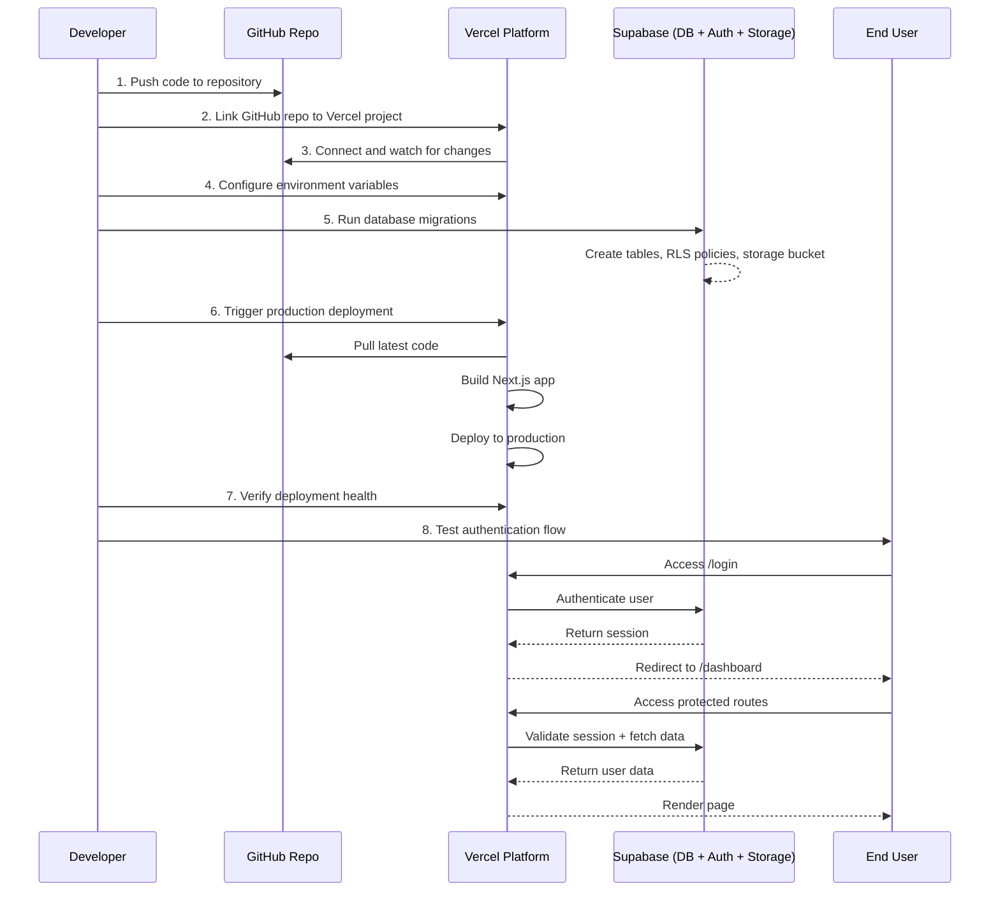

# Deployment Runbook

This document describes the deployment process for the Kin People App: GitHub + Vercel + Supabase (Auth, PostgreSQL, Storage).

## Key Observations

The application is a Next.js 14 app using Supabase Auth for authentication and Supabase PostgreSQL for the database. The deployment process involves setting up Vercel, configuring environment variables, running database migrations, and verifying the authentication flow. The codebase includes a setup script (`file:scripts/setup-github-and-vercel.sh`) and comprehensive documentation for environment variables (`file:docs/vercel-environment-variables.md`) and authentication (`file:docs/authentication.md`). Two database migrations exist that handle Supabase Auth integration and Storage bucket setup.

## Approach

The deployment follows a sequential approach: first establishing the GitHub repository and Vercel project connection, then configuring all required environment variables in Vercel, followed by running database migrations on the production Supabase instance, and finally conducting comprehensive testing of the deployed application. This ensures each layer (infrastructure, configuration, database, application) is properly set up before moving to the next, minimizing deployment issues and enabling quick rollback if needed.

---

## 1. Production Environment Variables Configuration

**Objective**: Configure all required environment variables in Vercel for production deployment.

**Access Vercel Dashboard**:
- Navigate to Vercel Dashboard → kin-people-app Project → Settings → Environment Variables
- Reference documentation: `file:docs/vercel-environment-variables.md`

**Required Variables** (set for **Production** environment):

| Variable Name | Source | Notes |
|---------------|--------|-------|
| `DATABASE_URL` | Supabase Dashboard → Settings → Database → Connection string | Use Transaction pooler connection string for better performance |
| `NEXT_PUBLIC_SUPABASE_URL` | Supabase Dashboard → Settings → API → Project URL | Format: `https://[project-ref].supabase.co` |
| `NEXT_PUBLIC_SUPABASE_ANON_KEY` | Supabase Dashboard → Settings → API → anon public | Public key for client-side auth |
| `SUPABASE_SERVICE_ROLE_KEY` | Supabase Dashboard → Settings → API → service_role | **Keep secret** - used for server-side operations |

**Optional Variables** (if SignNow document management is enabled):

| Variable Name | Source | Notes |
|---------------|--------|-------|
| `SIGNNOW_API_KEY` | SignNow Dashboard | API credentials |
| `SIGNNOW_API_SECRET` | SignNow Dashboard | API credentials |
| `SIGNNOW_WEBHOOK_SECRET` | SignNow webhook config | Verify webhook payloads (HMAC-SHA256) |
| `SIGNNOW_FROM_EMAIL` | Configuration | From address for invite emails (e.g., `noreply@yourdomain.com`) |

Configure webhook URL in SignNow: `https://<your-production-domain>/api/webhooks/signnow`. See `file:docs/signnow-go-live.md` and `file:docs/signnow-document-management.md`.

**Recommended Variable**:
- `NEXT_PUBLIC_APP_URL`: Set to your production URL (e.g., `https://kin-people-app.vercel.app` or custom domain)

**After Configuration**:
- Save all environment variables
- Trigger a new deployment: Deployments → Latest Deployment → ⋮ (three dots) → Redeploy
- Wait for the build to complete

**Supabase Auth (required for email confirmation)**:
- In Supabase Dashboard → **Authentication** → **URL Configuration**:
  - **Site URL**: Set to your production URL (e.g. `https://kin-people-app.vercel.app` or custom domain).
  - **Redirect URLs**: Add `https://your-production-domain.com/confirm` (and `https://your-production-domain.com/**` if you use wildcards). Email confirmation links will redirect here.

---

## 2. Database Migration Execution

**Objective**: Run database migrations on the production Supabase instance to set up the schema.

**Prerequisites**:
- Ensure `DATABASE_URL` environment variable is set locally to point to production Supabase
- Verify you have the correct production database credentials

**Migration Files to be Applied**:
- `file:drizzle/0000_futuristic_sabra.sql` - Migrates `people.auth_user_id` from varchar to UUID and adds `recruits.agreement_document_path`
- `file:drizzle/0001_supabase_agreements_bucket_rls.sql` - Creates `agreements` Storage bucket and RLS policies
- `file:drizzle/0005_documents_and_templates.sql` - Creates `documents` and `document_templates` tables (SignNow document management); seeds 4 document types

**Execution Steps**:
- Set the production `DATABASE_URL` in your local environment (temporarily in `.env.local` or export it)
- Run: `npm run db:migrate` (executes `tsx lib/db/migrate.ts` per `file:package.json`)
- Verify migration output shows "Migrations completed successfully"
- Check Supabase Dashboard → Database → Tables to confirm schema changes:
  - `people` table has `auth_user_id` column of type `uuid`
  - `recruits` table has `agreement_document_path` column
- Check Supabase Dashboard → Storage to confirm `agreements` bucket exists
- Verify RLS policies are applied: Storage → agreements bucket → Policies

**Troubleshooting**:
- If migration fails, check database connection string format
- Ensure SSL is enabled in connection string: `?sslmode=require`
- Verify Supabase project is accessible and not paused
- **"password authentication failed for user postgres" (code 28P01)**: The `DATABASE_URL` used when running the migrate script has the wrong password or user. **Local:** set `DATABASE_URL` in `.env.local` to your production Supabase URI with the correct password. **Production/CI:** set `DATABASE_URL` in that environment (e.g. Vercel → Settings → Environment Variables, or GitHub Actions secrets) to the same production Supabase URI with the correct password. In Supabase: **Project Settings → Database** → copy the **Connection string (URI)** and replace `[YOUR-PASSWORD]` with your actual database password (or reset it there).

---

## 3. Deployment Health Verification

**Objective**: Verify the application is successfully deployed and all routes are accessible.

**Deployment Status**:
- Check Vercel Dashboard → Deployments → Latest deployment status is "Ready"
- Note the production URL (e.g., `https://kin-people-app.vercel.app`)
- Review build logs for any warnings or errors

**Route Accessibility Tests**:

Test the following routes in a browser:

| Route | Expected Behavior | Reference |
|-------|-------------------|-----------|
| `/` | Redirects to `/login` (unauthenticated) | `file:app/page.tsx` |
| `/login` | Shows login form | `file:app/(auth)/login/page.tsx` |
| `/signup` | Shows signup form | `file:app/(auth)/signup/page.tsx` |
| `/dashboard` | Redirects to `/login` (unauthenticated) | `file:middleware.ts` |
| `/api/auth/me` | Returns 401 or redirects (unauthenticated) | Protected API route |

**Health Checks**:
- Verify no 500 errors on public routes
- Check browser console for JavaScript errors
- Verify CSS/styling loads correctly (Tailwind CSS)
- Test responsive design on mobile viewport

**Vercel Logs**:
- Monitor Vercel Dashboard → Logs for runtime errors
- Check for any database connection issues
- Verify environment variables are loaded correctly

---

## 4. Authentication Flow Testing

**Objective**: Comprehensively test the Supabase Auth integration in production.

### 6.1 User Signup Flow
- Navigate to `/signup` on production URL
- Fill in email and password (minimum 8 characters)
- Submit the form
- **Expected**: Success message "Check your email to confirm your account"
- Check email inbox for Supabase confirmation email
- Click confirmation link in email
- **Expected**: Redirects to `/confirm` page, then to `/dashboard`
- **Reference**: `file:app/(auth)/signup/page.tsx`

### 6.2 User Login Flow
- Navigate to `/login` on production URL
- Enter valid credentials (use test account or newly created account)
- Submit the form
- **Expected**: Redirects to `/dashboard`
- Verify user profile displays in navigation (name, email, role)
- **Reference**: `file:app/(auth)/login/page.tsx`, `file:app/(app)/dashboard/page.tsx`

### 6.3 Protected Route Access
- Without logging in, attempt to access `/dashboard` directly
- **Expected**: Redirects to `/login`
- After login, access `/dashboard`
- **Expected**: Dashboard loads with user data
- Try accessing `/people`, `/recruiting`, `/deals`, `/commissions`
- **Expected**: Routes load based on user permissions
- **Reference**: `file:middleware.ts`, `file:docs/authentication.md`

### 6.4 User Logout Flow
- While logged in, trigger logout (via user menu or API call)
- **Expected**: Session cleared, redirects to `/login`
- Attempt to access `/dashboard` after logout
- **Expected**: Redirects to `/login`
- **Reference**: `file:app/api/auth/logout/route.ts`

### 6.5 Session Persistence
- Log in to the application
- Close the browser tab
- Reopen the production URL
- **Expected**: User remains logged in (session persisted via Supabase cookies)
- **Reference**: `file:lib/supabase/middleware.ts`

### 6.6 API Authentication
- While logged in, check browser DevTools → Network tab
- Navigate to `/dashboard`
- Verify API calls to `/api/auth/me`, `/api/commissions`, `/api/deals` succeed (200 status)
- Log out and attempt to access `/api/auth/me` directly
- **Expected**: 401 Unauthorized or redirect
- **Reference**: `file:lib/auth/route-protection.ts`

**Test User Setup** (if needed):
- Create a test user via Supabase Dashboard → Authentication → Users → Add User
- Or use the signup flow to create a test account
- Ensure the user has a linked person record (may require running `/api/auth/sync-user` or manual database entry)

**Validation Checklist**:
- [ ] Signup creates new Supabase Auth user
- [ ] Email confirmation works
- [ ] Login authenticates successfully
- [ ] Dashboard loads with user data
- [ ] Protected routes redirect unauthenticated users
- [ ] Logout clears session
- [ ] Session persists across browser sessions
- [ ] API routes enforce authentication

---

## 5. Post-Deployment Verification

**Objective**: Ensure the production environment is stable and ready for pilot users.

**Database Verification**:
- Check Supabase Dashboard → Database → Tables for expected schema
- Verify `roles` table has seed data (Admin, Office Manager, Team Lead, Sales Rep)
- If seed data is missing, run: `tsx lib/db/seed.ts` with production `DATABASE_URL`
- **Reference**: `file:lib/db/seed.ts`

**Storage Verification**:
- Verify `agreements` bucket exists in Supabase Dashboard → Storage
- Check RLS policies are active
- Test file upload (if possible) via recruiting flow or manual test
- **Reference**: `file:docs/supabase-storage-agreements.md`

**Performance Check**:
- Test page load times for key routes (`/dashboard`, `/people`, `/recruiting`)
- Verify API response times are acceptable (<2 seconds)
- Check Vercel Analytics (if enabled) for performance metrics

**Error Monitoring**:
- Set up error tracking (Vercel logs, Sentry, or similar)
- Monitor for any runtime errors in production
- Check for database connection pool issues

**Documentation**:
- Document the production URL
- Record all environment variable values (securely)
- Note any deployment-specific configurations
- Create a rollback plan (previous deployment version in Vercel)

---

## Deployment Architecture

---

## Environment Variables Summary

| Category | Variables | Count |
|----------|-----------|-------|
| **Required** | DATABASE_URL, NEXT_PUBLIC_SUPABASE_URL, NEXT_PUBLIC_SUPABASE_ANON_KEY, SUPABASE_SERVICE_ROLE_KEY | 4 |
| **Optional (SignNow)** | SIGNNOW_API_KEY, SIGNNOW_API_SECRET, SIGNNOW_WEBHOOK_SECRET, SIGNNOW_FROM_EMAIL | 4 |
| **Recommended** | NEXT_PUBLIC_APP_URL | 1 |

---

## Critical Success Factors

1. **Environment Variables**: All required Supabase credentials must be correctly configured in Vercel
2. **Database Migrations**: All migration files (including `0005_documents_and_templates.sql` if using SignNow document management) must run successfully on production Supabase
3. **Authentication**: Supabase Auth must be properly integrated with session management working
4. **Storage Setup**: The `agreements` bucket and RLS policies must be created for document handling
5. **Route Protection**: Middleware must correctly protect authenticated routes and redirect unauthenticated users
6. **SignNow (optional)**: If using document management, set SignNow env vars, run migrations for `documents`/`document_templates`, and register the webhook URL per `file:docs/signnow-go-live.md`

---

## Rollback Plan

If deployment issues occur:
- **Vercel**: Deployments → Previous Deployment → Promote to Production
- **Database**: Migrations are forward-only; rollback requires manual SQL or restore from backup
- **Environment Variables**: Revert to previous values in Vercel settings and redeploy
